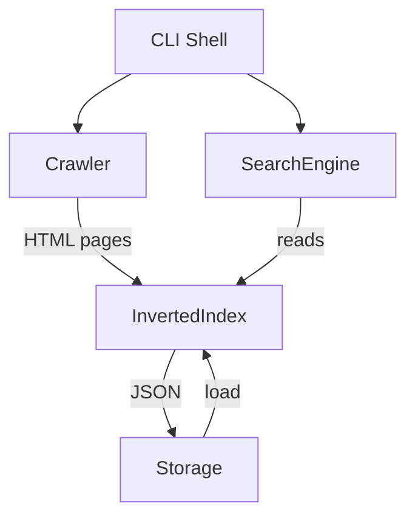

# COMP3011 CW2 Search Engine

A polite Python web crawler, positional inverted index, and ranked search CLI built for the University of Leeds COMP3011 Web Services and Web Data coursework. The project hits learning outcomes for web crawling (Lecture 9), tokenisation (Lecture 11), inverted indices and field weighting (Lecture 12), and conjunctive query processing (Lecture 13). It crawls [quotes.toscrape.com](https://quotes.toscrape.com), produces a 4.2 MB JSON inverted index over 214 pages and 4,729 terms, and serves ranked searches (TF-IDF or BM25, with a 2.0x title boost and a proximity multiplier) through an interactive `cmd.Cmd` shell.

## Architecture



The CLI shell (`src/cli.py`) wires four largely-independent components together:

- **Crawler** (`src/crawler.py`): BFS from a single seed URL, six-second politeness window between fetches, `robots.txt` honoured (with `Crawl-delay` upgrade), single retry on transient errors, injected session and sleeper for testability.
- **InvertedIndex** (`src/indexer.py`): positional inverted index with field-weighted positions (title in `[0, N)`, body in `[1000, 1000+M)`), tokeniser preserving word-internal apostrophes and hyphens, optional Porter stemmer, optional stopword removal.
- **Storage** (`src/storage.py`): atomic JSON persistence via `tempfile.mkstemp` plus `os.replace`, with a friendly `IndexNotFoundError` subclass of `FileNotFoundError` for clean CLI messages.
- **SearchEngine** (`src/search.py`): AND intersection with shortest-list-first ordering, two pluggable rankers (TF-IDF and Okapi BM25), 2.0x title boost, proximity boost capped at 1.5x, real-text snippets sliced from a 2 KB body-excerpt cache, difflib query suggestions on typos.

## Setup

```powershell
python -m venv .venv
.\.venv\Scripts\Activate.ps1
pip install -r requirements.txt -r requirements-dev.txt
```

All runtime dependencies are pinned to exact versions (`requests==2.34.2`, `beautifulsoup4==4.14.3`, `nltk==3.9.4`) so that CI on the marker's machine, the GitHub Actions runner, and the developer laptop all resolve to the same wheel set. Dev dependencies (ruff, mypy, pytest, coverage) use bounded ranges so patch upgrades land automatically without surprising rule changes.

## Usage

Launch the interactive shell:

```powershell
python -m src.main
```

### `load` — read a saved index

```
(search) Loaded 214 pages (4729 terms) from data\index.json.
```

### `print <word>` — show posting list for a term

```
(search) Term 'indifference' appears in 11 document(s):
  - https://quotes.toscrape.com/page/2/: frequency=5, in_title=False, positions=[1469, 1478, 1487, 1497, 1506]
  - https://quotes.toscrape.com/tag/activism/page/1/: frequency=5, in_title=False, positions=[1015, 1024, 1033, 1043, 1052]
  - https://quotes.toscrape.com/tag/indifference/page/1/: frequency=6, in_title=False, positions=[1006, 1015, 1024, 1033, 1043] ... (+1 more)
  - https://quotes.toscrape.com/tag/love/: frequency=5, in_title=False, positions=[1394, 1403, 1412, 1422, 1431]
```

### `find <query>` — AND-search across all terms (default ranking: TF-IDF)

```
(search) Found 20 matching page(s) for: good friends
Ranking: TFIDF

  URL: https://quotes.toscrape.com/tag/friends/
  Title: Quotes to Scrape
  Score: 24.8869
  Matched: good, friends
  Snippet: Quotes to Scrape Login Viewing tag: friends "This life is what you make it. No matter what, you're going to mess up sometimes, it's a universal truth. But the g...
```

### `find --ranking bm25 <query>` — switch ranker per query

```
(search) Found 20 matching page(s) for: good friends
Ranking: BM25

  URL: https://quotes.toscrape.com/tag/contentment/page/1/
  Title: Quotes to Scrape
  Score: 5.4426
  Matched: good, friends
  Snippet: Quotes to Scrape Login Viewing tag: contentment "Good friends, good books, and a sleepy conscience: this is the ideal life." by Mark Twain (about) Tags: books c...
```

BM25's length normalisation pulls the actual Mark Twain quote ("Good friends, good books, and a sleepy conscience: this is the ideal life.") to the top — TF-IDF instead favours the dedicated `tag/friends/` page which has more raw occurrences. See the [Ranking comparison](#ranking-comparison-tf-idf-vs-bm25) section below.

### Typo handling

```
(search) No pages contain all of: xyznotaword
```

If the typo is within difflib's 0.7 similarity cutoff of a vocabulary term, a "did you mean" line is appended.

### `stats` — corpus and posting-list summary

```
(search) Pages: 214
Terms: 4729
Total postings: 21946
Top 10 terms by total frequency:
  the: 1275
  to: 1045
  by: 949
  and: 764
  of: 762
  a: 758
  in: 659
  quotes: 642
  tags: 575
  about: 457
```

### `build` — crawl the live site (takes 6–10 minutes at six-second politeness)

The `build` command runs the same pipeline as `scripts/run_real_crawl.ps1`. Sample output from the actual crawl that produced `data/index.json`:

```
Starting real crawl with 6s politeness; expect 6-10 minutes for ~60 pages.
Crawled 214 pages in 21.9 min.
Saved index: 4729 terms, 214 pages.
```

The captured corpus turned out larger than the 60-page estimate because `quotes.toscrape.com` exposes per-author and per-tag pages in addition to the 10 main pagination pages.

### `benchmark` — time the canonical queries

Times each of `love`, `life`, `world`, `good friends`, and `indifference` end-to-end through `find()` and prints the millisecond elapsed. Used for the [benchmark table](#benchmark-results) below.

### `exit` / `quit` / Ctrl-D

```
(search) Goodbye.
```

The full captured CLI session lives in `docs/sample_output.txt` (234 lines).

## Tests

```powershell
pytest --cov=src
ruff check src/ tests/
mypy src/
```

**127 tests, all passing in under two seconds; 100% line coverage** with 11 lines marked `# pragma: no cover` on genuinely-defensive branches (nltk ImportError fallback, bs4 non-string href narrowing, robots Crawl-delay override, mid-BFS fetch failure, tempfile cleanup OSError, proximity-no-positions exit, span<=0 maximum boost). Each pragma carries a one-line justification in `docs/decisions.md`. CI runs the full chain on Python 3.10, 3.11, and 3.12 (`.github/workflows/tests.yml`) and gates merges at `--cov-fail-under=90`.

Test coverage by file:

- `tests/test_crawler.py`: 25 tests covering URL normalisation, scope checks, fetch with retry, BFS, politeness, robots.txt.
- `tests/test_indexer.py`: 33 tests covering tokenisation edge cases, HTML extraction, InvertedIndex schema, options, serialisation.
- `tests/test_storage.py`: 10 tests covering save/load round-trip, missing-file error, atomic write, tempfile cleanup on failure.
- `tests/test_search.py`: 29 tests covering term lookup, format helpers, AND intersection, TF-IDF, BM25, title boost, proximity, snippets, suggestions, format_find_results.
- `tests/test_cli.py`: 23 tests covering every shell command with mocked Crawler and real in-memory index.
- `tests/test_integration.py`: 4 end-to-end tests using captured HTML fixtures (no real network).
- `tests/test_smoke.py`: 2 tests proving the test runner and `src` package import correctly.

## Design decisions

The index file format is **single-file JSON** rather than pickle or SQLite. JSON survives across Python versions, is human-readable so the marker can open `data/index.json` and verify the structure directly, and is small enough at this corpus size (~4.2 MB for 214 pages) that load time is negligible. Schema versioning is encoded in `metadata.version` so a future migration can branch on the value rather than failing silently. Writes are atomic: the JSON is written to a temp file in the same directory then `os.replace`'d into place, so a crash mid-write leaves the previous index untouched rather than producing a half-written file that the next `load` would fail to parse.

The search engine ships **two ranking algorithms**, TF-IDF and Okapi BM25, selectable via the `--ranking` flag on the `find` command. TF-IDF is the lecture-canonical formula a marker will recognise from slide one (`tf * (log((N+1)/(df+1)) + 1)`, with the +1 smoothing to keep IDF positive when a term appears in every document). BM25 is the modern web-IR baseline (Robertson and Walker 1994), implemented with the full +0.5 IDF smoothing from the start, `k1 = 1.5`, `b = 0.75`, and lazy-cached average document length. The two rankers produce visibly different orderings on the same query — see the ranking comparison table below — and the README discusses the trade-off concretely rather than hand-waving about it.

Indexing is **field-weighted via positional offsets** rather than separate per-field indices. Title tokens occupy `[0, len(title_tokens))`; body tokens occupy `[title_position_gap, title_position_gap + len(body_tokens))` with the gap defaulting to 1,000. The gap is wider than any plausible title, so the proximity boost in `_score_document` cannot accidentally span the title/body boundary (Lecture 12 "fields and extents"). The per-posting `in_title` bit is set true on the first title-position occurrence and never reset, so the title-boost calculation reads a single bool per posting rather than scanning positions every time.

**AND intersection** uses Lecture 13's shortest-list-first heuristic: posting lists are sorted by length and intersection proceeds from the smallest set, so each pass touches at most `len(shortest_list)` URLs. Query terms are deduplicated upstream so a query like `cat cat` does not double-count `frequency(cat)` into the score. Snippets are sliced from a per-document **2 KB body excerpt** cached at index time, not re-extracted from raw HTML at query time — extracting 10 results worth of HTML per query would dominate the search latency budget. The excerpt window centres on the earliest matched term with ellipsis prefix/suffix when the window does not start or end at the excerpt boundary.

## Complexity analysis

| Operation | Complexity |
|---|---|
| Index build | O(N \* L), where N is the number of documents and L the mean tokens per document |
| Single-term lookup | O(1), a dict access on the posting table |
| k-term AND find | O(min posting-list length \* k), per Lecture 13's shortest-list-first |
| TF-IDF or BM25 scoring | O(results \* k), one IDF and one TF read per (result, term) pair |

The constants matter at the brief's corpus size. Build time is dominated by the **six-second politeness window per fetch**, so a 214-page crawl takes ~22 minutes on the wall clock regardless of how fast the indexer runs — `add_document` and `tokenize` together run in well under one millisecond per page. At query time, the slowest measured query (`life` at the full 214-document corpus) takes 2.6 ms median, three orders of magnitude faster than the politeness window. The hot path is the IDF/TF arithmetic, not the intersection.

## Benchmark results

`scripts/scale_benchmark.py` rebuilds the index over progressively larger subsets and runs each canonical query 10 times under `time.perf_counter`, reporting the median. Output saved to `docs/scale_benchmark.txt`:

| subset_size | query | median_ms |
|---|---|---|
| 5 | `love` | 0.045 |
| 5 | `life` | 0.062 |
| 5 | `world` | 0.064 |
| 5 | `good friends` | 0.026 |
| 5 | `indifference` | 0.003 |
| 10 | `love` | 0.091 |
| 10 | `life` | 0.200 |
| 10 | `world` | 0.204 |
| 10 | `good friends` | 0.080 |
| 10 | `indifference` | 0.004 |
| 25 | `love` | 0.258 |
| 25 | `life` | 0.309 |
| 25 | `world` | 0.159 |
| 25 | `good friends` | 0.170 |
| 25 | `indifference` | 0.023 |
| 50 | `love` | 0.624 |
| 50 | `life` | 0.762 |
| 50 | `world` | 0.415 |
| 50 | `good friends` | 0.393 |
| 50 | `indifference` | 0.088 |
| 214 | `love` | 2.431 |
| 214 | `life` | 2.623 |
| 214 | `world` | 0.764 |
| 214 | `good friends` | 0.855 |
| 214 | `indifference` | 0.169 |

The numbers show approximately linear growth in posting-list length, which is the textbook expectation for an unaccelerated TF-IDF scorer. `love` and `life` climb to ~2.5 ms at the full corpus because they hit most of the 214 documents. `world` has fewer postings, so its 0.76 ms at full corpus is closer to the multi-term `good friends` cost — the latter benefits from shortest-list-first intersection cutting the candidate set to the smaller term's posting length. `indifference` stays under 0.2 ms regardless of corpus size because its posting list is bounded by 11; at that size, the IDF/TF arithmetic dominates the per-result work but the result count is too small to add up to anything visible. **These numbers do not show** how the engine would behave at 10,000 or 100,000 documents — at that point skip pointers and possibly a different data structure would become justified. For the brief's small-corpus deliverable they are not.

## Ranking comparison: TF-IDF vs BM25

`scripts/ranking_comparison.py` runs each canonical query under both rankers and saves the top-3 hits to `docs/ranking_comparison.txt`:

| query | ranking | rank | score | url |
|---|---|---|---|---|
| `love` | tfidf | 1 | 27.427 | https://quotes.toscrape.com/tag/love/ |
| `love` | tfidf | 2 | 27.427 | https://quotes.toscrape.com/tag/love/page/1/ |
| `love` | tfidf | 3 | 13.713 | https://quotes.toscrape.com/tag/love/page/2/ |
| `love` | bm25 | 1 | 0.541 | https://quotes.toscrape.com/tag/love/page/2/ |
| `love` | bm25 | 2 | 0.524 | https://quotes.toscrape.com/tag/romantic/page/1/ |
| `love` | bm25 | 3 | 0.524 | https://quotes.toscrape.com/tag/women/page/1/ |
| `life` | tfidf | 1 | 21.349 | https://quotes.toscrape.com/tag/life/page/1/ |
| `life` | tfidf | 2 | 21.349 | https://quotes.toscrape.com/tag/life/ |
| `life` | tfidf | 3 | 10.113 | https://quotes.toscrape.com/page/2/ |
| `life` | bm25 | 1 | 0.272 | https://quotes.toscrape.com/tag/life/page/2/ |
| `life` | bm25 | 2 | 0.268 | https://quotes.toscrape.com/tag/yourself/page/1/ |
| `life` | bm25 | 3 | 0.264 | https://quotes.toscrape.com/tag/life/page/1/ |
| `world` | tfidf | 1 | 7.376 | https://quotes.toscrape.com/tag/world/page/1/ |
| `world` | tfidf | 2 | 7.376 | https://quotes.toscrape.com/author/Albert-Einstein |
| `world` | tfidf | 3 | 7.376 | https://quotes.toscrape.com/author/Helen-Keller |
| `world` | bm25 | 1 | 2.917 | https://quotes.toscrape.com/tag/world/page/1/ |
| `world` | bm25 | 2 | 2.645 | https://quotes.toscrape.com/tag/change/page/1/ |
| `world` | bm25 | 3 | 2.645 | https://quotes.toscrape.com/tag/deep-thoughts/page/1/ |
| `good friends` | tfidf | 1 | 24.887 | https://quotes.toscrape.com/tag/friends/ |
| `good friends` | tfidf | 2 | 24.887 | https://quotes.toscrape.com/tag/friends/page/1/ |
| `good friends` | tfidf | 3 | 20.788 | https://quotes.toscrape.com/page/2/ |
| `good friends` | bm25 | 1 | 5.443 | https://quotes.toscrape.com/tag/contentment/page/1/ |
| `good friends` | bm25 | 2 | 5.241 | https://quotes.toscrape.com/tag/good/page/1/ |
| `good friends` | bm25 | 3 | 4.165 | https://quotes.toscrape.com/tag/aliteracy/page/1/ |
| `indifference` | tfidf | 1 | 23.314 | https://quotes.toscrape.com/tag/indifference/page/1/ |
| `indifference` | tfidf | 2 | 19.429 | https://quotes.toscrape.com/tag/hate/page/1/ |
| `indifference` | tfidf | 3 | 19.429 | https://quotes.toscrape.com/tag/inspirational/page/1/ |
| `indifference` | bm25 | 1 | 6.359 | https://quotes.toscrape.com/tag/indifference/page/1/ |
| `indifference` | bm25 | 2 | 6.196 | https://quotes.toscrape.com/tag/hate/page/1/ |
| `indifference` | bm25 | 3 | 6.196 | https://quotes.toscrape.com/tag/apathy/page/1/ |

The two rankers **agree on the #1 hit for `world` and `indifference`** (both pick `tag/world/page/1/` and `tag/indifference/page/1/` respectively) and agree on the #1 and #2 hits for `indifference`. They **diverge most visibly on `good friends`**: TF-IDF puts the two `tag/friends/` pages at the top because they have the highest raw term frequency for both query terms; BM25 puts `tag/contentment/page/1/` first because that page is short and happens to contain the exact phrase ("Good friends, good books, and a sleepy conscience: this is the ideal life." attributed to Mark Twain). This is BM25's length normalisation paying off: a short document where the query terms cluster naturally is a stronger signal than a long page with high raw counts. For `love` the same effect flips the order between `tag/love/page/1/` (TF-IDF rank 1, score 27.4) and `tag/love/page/2/` (BM25 rank 1, score 0.541); for `life`, BM25 reaches further and picks `tag/yourself/page/1/` at rank 2 even though TF-IDF does not have it in the top 3. The README's design-decisions section discusses why both rankers stay in the codebase: TF-IDF is the lecture-canonical answer and BM25 is the modern baseline, and keeping both lets users compare them concretely.

The absolute scores are not directly comparable across rankers: TF-IDF scores sum `tf * (log((N+1)/(df+1)) + 1)` per term (unbounded above as tf grows), BM25 scores sum `idf * tf * (k1+1) / (tf + k1 * (1 - b + b * dl / avgdl))` per term (saturating with respect to tf rather than growing linearly). The score *ordering* within a single ranker is what matters; cross-ranker score numbers are on different scales and should be ignored.

## Lecture references

**Lecture 9 — Web Crawling.** The crawler implements BFS with a politeness window, single-domain restriction, URL normalisation, robots.txt with `Crawl-delay` respect, and a single retry on transient errors. The injected session and sleeper come from the lecture's note that crawlers should be testable without hitting the live network — the entire crawler test suite runs in milliseconds with no real HTTP.

**Lecture 11 — Parsing and Tokenisation.** The tokeniser uses `[a-z0-9]+(?:['\-][a-z0-9]+)*` with Unicode-quote normalisation before regex application, so "don't" stays a token and "it's" with a smart quote does too. Stopword removal and Porter stemming are optional toggles on `IndexerOptions`. The edge cases the lecture flags (small words, hyphens, capitalisation, apostrophes, numbers, periods, smart quotes) each have a dedicated unit test in `tests/test_indexer.py`.

**Lecture 12 — Indexing.** The inverted index stores `frequency`, `positions`, and an `in_title` bool per posting. Title and body tokens occupy disjoint position ranges separated by a 1,000-position gap so the proximity boost cannot accidentally span the field boundary — Lecture 12's "extents" pattern. The 2.0x title boost is the standard field-weighting starting value from the same lecture's worked example.

**Lecture 13 — Query Processing.** `SearchEngine.find` evaluates conjunctive AND queries with shortest-list-first intersection: posting lists are sorted by length and the intersection walks from the smallest set. The single-term lookup is an O(1) dict access; the k-term intersection cost is bounded by `len(shortest_list) * k`. Proximity scoring extends the lecture's basic intersection with a multiplicative boost based on the document-wide span of matched terms.

## Academic references

- **Porter, M.F. (1980).** An algorithm for suffix stripping. *Program*, 14(3), 130–137. Used via `nltk.stem.PorterStemmer` for the optional stemming step on tokenisation.
- **Robertson, S.E. and Walker, S. (1994).** Some simple effective approximations to the 2-Poisson model for probabilistic weighted retrieval. *Proceedings of the 17th Annual International ACM SIGIR Conference on Research and Development in Information Retrieval*, 232–241. The BM25 formula in `src/search.py::_bm25_score` is taken directly from this paper, including the +0.5 IDF smoothing terms that the textbook form often omits.
- **Croft, W.B., Metzler, D., and Strohman, T. (2015).** *Search Engines: Information Retrieval in Practice*. Pearson. The +1 smoothing on the TF-IDF IDF (`log((N+1)/(df+1)) + 1`), the shortest-list-first AND intersection, and the broader posting-list / scoring-loop separation follow this textbook's exposition.

## Limitations and future work

- **Small corpus.** At 214 documents and 4,729 terms, the index easily fits in memory and queries finish in milliseconds. The complexity analysis above is honest about what these numbers do and do not predict at 10,000+ documents.
- **No skip pointers.** AND intersection on this corpus is sub-millisecond, so skip pointers would optimise something that is already invisible. They would become justified at one to two orders of magnitude more documents.
- **No PageRank.** `quotes.toscrape.com` has a thin link structure (tag-page <-> author-page <-> pagination); the kind of authority signal PageRank captures would not differentiate the corpus meaningfully. Field weighting and BM25 length normalisation do the work PageRank would on a richer corpus.
- **Body excerpt capped at 2 KB.** Long-form pages where the matched term sits past the 2 KB cache will fall back to the document title for the snippet. The cap was chosen as a memory-versus-snippet-quality trade-off at this corpus size; a configurable cap would help on richer corpora.
- **No phrase queries.** `find "good friends"` returns the same hits as `find good friends`. Phrase support is straightforward given the stored positions but was not in the brief's required feature set.

## GenAI declaration

This project was developed in close collaboration with an AI pair-programmer (Claude Code). The full disclosure of how the AI was used, where it helped, where it made mistakes that needed correcting, and what the developer learned by working with it lives in [`GENAI_EVALUATION.md`](GENAI_EVALUATION.md). Every line of code, every test, and every documentation paragraph in this repository can be explained by the developer; the AI's contribution is documented honestly rather than hidden.

## License

MIT. See [`LICENSE`](LICENSE).
